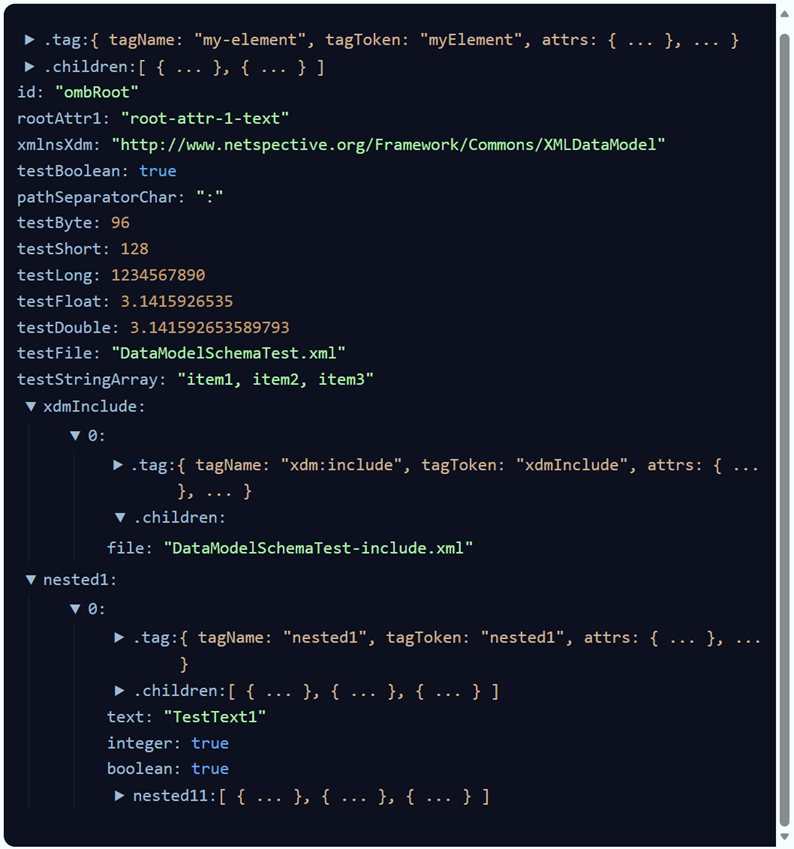
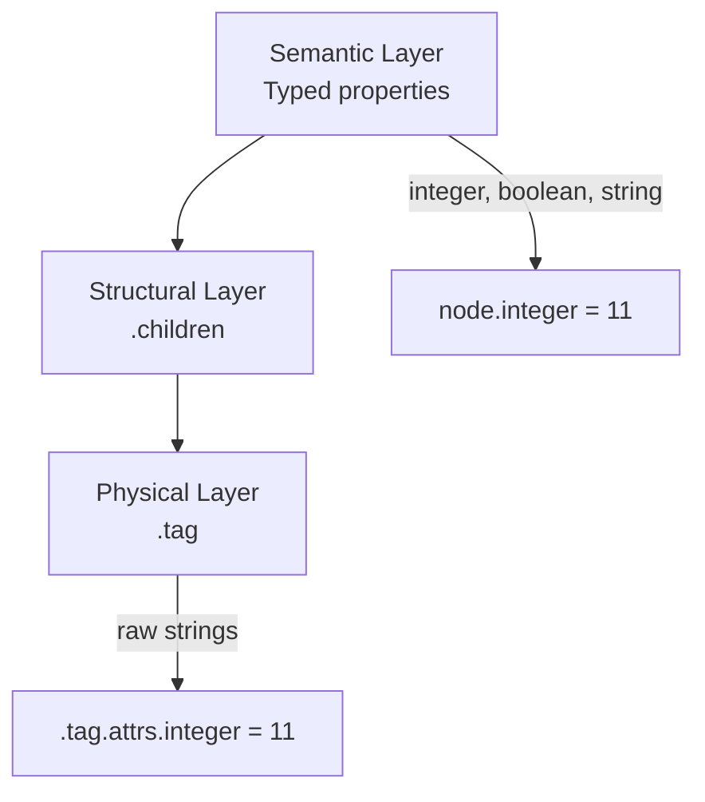
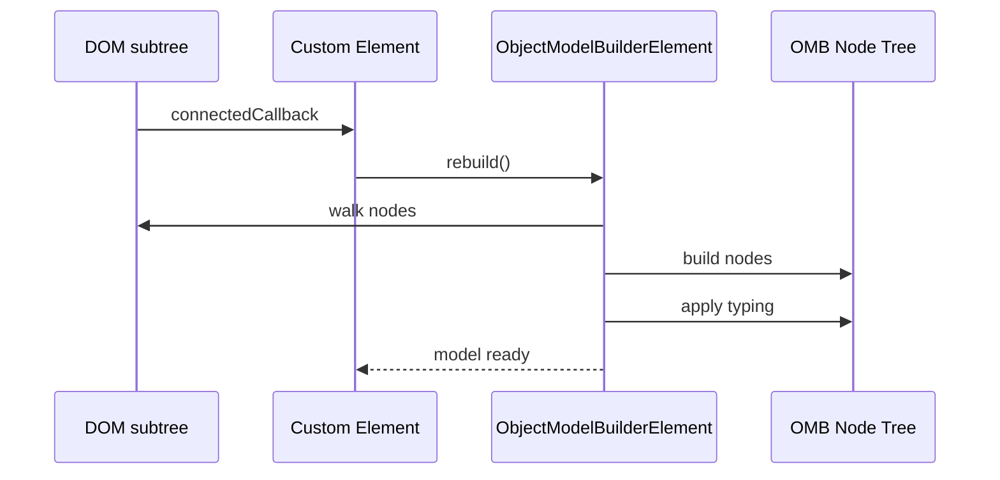
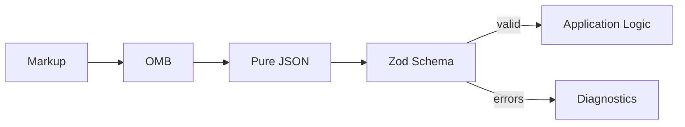

# Extensible Data Models (`XDM`)

## Natural Object Model Builder (OMB)

**Object Model Builder (OMB)** is a browser-native, Web Components–friendly
utility that transforms DOM markup into a structured, typed-is "natural"
JavaScript object model.

Natural Object Model's `OMB` is designed for scenarios where:

- XML- or HTML-like markup is used as a declarative DSL
- You want a clean separation between _physical syntax_ and _semantic data_
- You want automatic, overridable type inference
- You want to introspect, transform, or execute logic over a DOM-derived object
  graph

OMB intentionally avoids frameworks and uses modern JavaScript, Custom Elements,
and JSDoc typing for IDE support.

OMB can be used in **two complementary ways**:

1. As a **Web Component** (`ObjectModelBuilderElement`) that parses its own DOM
   subtree or an external XML source.
2. As a **pure factory-style builder** (`OmbBuilder`) with no custom elements,
   suitable for scripts, loaders, inspectors, or headless-style usage.

💡 Run `support/learn/index.ts` from the root of this project and pick _Natural
Object Model Guide_ learning resources to get an idea for what this module does.
You can read this `README.md` interactively using the guide and see a running
example plus load your own.

## High-level concepts

OMB builds a **tree of model nodes** from the DOM subtree of a custom element.

Each node has **three distinct layers**:

1. **Physical tag metadata** Stored under `node[".tag"]`

2. **Structural children** Stored under `node[".children"]`

3. **Typed semantic properties** Exposed directly on the node via getters and
   setters

This makes it easy to:

- Inspect raw markup
- Traverse structure
- Work with typed values naturally

## Node shape

If this is the XML in HTML (`my-element` would be the custom element in this
case):

```xml
<my-element id="ombRoot" root-attr-1="root-attr-1-text-in-attr"
    xmlns:xdm="http://www.netspective.org/Framework/Commons/XMLDataModel">
    PCDATA in root.

    <root-attr-1>root-attr-1-text</root-attr-1>

    <test-boolean>yes</test-boolean>
    <path-separator-char>:</path-separator-char>
    <test-byte>96</test-byte>
    <test-short>128</test-short>
    <test-long>1234567890</test-long>
    <test-float>3.1415926535</test-float>
    <test-double>3.1415926535897932384626433</test-double>
    <test-file>DataModelSchemaTest.xml</test-file>
    <test-string-array>item1, item2, item3</test-string-array>

    <xdm:include file="DataModelSchemaTest-include.xml"></xdm:include>

    <nested1 text="TestText1" integer="1" boolean="yes">
        PCDATA in nested1.

        <nested11 text="TestText11" integer="11"></nested11>

        <nested11>
            <type>type-C</type>
            <text>TestText12</text>
            <integer>12</integer>
        </nested11>

        <nested11 class="com.netspective.commons.xdm.DataModelSchemaTest$CustomNested11Test"
            text="CustomTestText12" integer="122" bit-mask="BIT_THREE | BIT_FIVE | BIT_EIGHT" bit-three="on"
            bit-ten="on"></nested11>
    </nested1>
</my-element>
```

Then a node produced by OMB looks conceptually like this:



### `.tag` (physical layer)

- `tagName` Exact tag name as written in markup (not uppercased)

- `tagToken` camelCase identifier derived from the tag name

- `attrs` Raw attribute values as strings Keys are camelCase versions of the
  original attribute names

- `content` Raw PCDATA segments encountered under the element

- `value` Leaf/simple value derived from text content (if applicable)

### `.children` (structural layer)

An array of child nodes that represent real structural nesting.

### Typed properties (semantic layer)

For every attribute or eligible child element:

- A property exists directly on the node
- Default getter auto-types the raw string
- Setter writes back to `.tag.attrs`

Example:

```js
node.integer; // → 11 (number)
node.boolean; // → true (boolean)
node.testLong; // → 1234567890
node[".tag"].attrs.integer; // → "11"
```

## Pre-defined typing with `omb:type`

```xml
<test-string-array omb:type="text-list-safe">
  item1, item2, item3
</test-string-array>
```

Behavior:

- The raw text (`"item1, item2, item3"`) is always preserved at
  `node[".tag"].rawValue`
- The typed result is stored at `node[".tag"].value`
- If the element is treated as a child-as-attribute, the parent property getter
  returns the typed value
- Raw strings are always stored in `.tag.attrs`

Named typings are resolved via:

- `typedValueByName(name)` option, if provided
- Built-in defaults (for example `text-list`, `text-list-safe`)

This is the recommended and safest way to apply custom typing logic.

## Inline typing with `omb:type-as`

For advanced or ad-hoc use cases, OMB also supports inline typing expressions
via the special attribute `omb:type-as`.

`omb:type-as` treats its value as the body of a typed-value expression and
evaluates it at runtime.

## Child elements as attributes

OMB supports treating **simple child elements** as attributes instead of
structural children.

Example markup:

```xml
<test-boolean>yes</test-boolean>
```

By default, this becomes:

```js
node.testBoolean === true;
```

instead of:

```js
node[".children"][0];
```

### Default rule

A child element is treated as an attribute if:

- It has no attributes
- It has no element children
- It has simple text content

You can override this logic via options.

## Auto-typing behavior

By default, OMB attempts to infer types from strings:

- `"true"`, `"yes"`, `"on"`, `"1"` → `true`
- `"false"`, `"no"`, `"off"`, `"0"` → `false`
- Integers → `number`
- Floats / scientific notation → `number`
- `"null"`, `"undefined"` → `null`
- Everything else → `string`

This behavior is centralized and overridable.

## Factory-style usage (no Custom Elements)

OMB can be used **without defining any custom elements**.

This is useful for:

- Static inspectors
- Loaders
- Tests
- DSL tooling
- Scripts
- Sandboxes

### Building directly from XML

```js
import { createOmbBuilder } from "./omb.js";

const builder = createOmbBuilder();

const model = await builder.buildFromXmlSrc("./fixtures/fixture-01.xml", {
  host: document.documentElement,
});

const json = JSON.parse(
  JSON.stringify(model.toJSON({ withTags: true })),
);
```

### Building from an existing DOM element

```js
const rootEl = document.querySelector("#someContainer");

const model = builder.buildFromDomRoot(rootEl, {
  host: rootEl,
});
```

No lifecycle, no custom element registration, no side effects.

## Web Component usage

### Importing

```js
import { ObjectModelBuilderElement } from "./omb.js";
```

### Defining a custom element

```js
class MyElement extends ObjectModelBuilderElement {
  constructor() {
    super({
      typedValue: (raw) => raw === "yes" ? true : raw,
    });
  }
}

customElements.define("my-element", MyElement);
```

### Using with `omb:src`

```html
<my-element omb:src="./config.xml"></my-element>
```

The XML is fetched, parsed, and converted into a model automatically.

## Typing features

### Auto-typing (default)

- yes / true / on / 1 → `true`
- no / false / off / 0 → `false`
- integers → `number`
- floats / scientific notation → `number`
- null / undefined → `null`
- otherwise → `string`

### Named typing with `omb:type`

```xml
<items omb:type="text-list-safe">
  a, b, c
</items>
```

- Raw string preserved at `.tag.rawValue`
- Typed value stored at `.tag.value`
- Parent getter returns typed value when used as child-attribute

### Inline typing with `omb:type-as`

```xml
<count omb:type-as="Number(raw) * 2">21</count>
```

Evaluated at runtime. Use only with trusted markup.

### Options

`ObjectModelBuilderElementOptions` supports:

- `ignoreWhitespaceText` Ignore whitespace-only text nodes (default: true)

- `ignoreComments` Ignore comment nodes (default: true)

- `ignoreElement(el)` Skip an element and its subtree entirely

- `createElement(tagName, element)` Return a custom constructor for a tag Return
  `false` to use OMB’s generated class

- `typedValue(rawValue, ombTag)` Override auto-typing logic globally

- `isChildElemAttr(childTag, parentTags)` Decide whether a child element should
  be treated as an attribute

### Hooks

You may optionally implement:

- `createRoot(element)` Create a custom root node

- `collectContent(text, context)` Intercept raw PCDATA during parsing

## JSON serialization

OMB nodes implement `toJSON()`.

This produces a **clean, cycle-free JSON representation** suitable for
inspection, storage, or debugging.

Example:

```js
const json = JSON.stringify(model, null, 2);
```

## `index.html` helper

The included `index.html` is a **development and inspection helper**, not a
dependency.

It provides:

- A live `<my-element>` sandbox
- Automatic rebuild of the model
- Rendering via `@alenaksu/json-viewer`
- Expand/collapse controls

## Architecture overview

OMB intentionally separates concerns into **three layers**.

### Layered node model



- **Physical layer (`.tag`)** Preserves exactly what was written.

- **Structural layer (`.children`)** Represents true containment and nesting.

- **Semantic layer (typed properties)** Provides ergonomic, typed access for
  application logic.

## Runtime flow



## Why OMB vs DOM vs AST

### DOM

**Strengths**

- Rendering
- Mutation
- Browser-native

**Weaknesses**

- No semantics
- No typing
- Poor DSL ergonomics

DOM answers _how to display_, not _what this means_.

### ASTs

**Strengths**

- Formal grammars
- Compilers
- Static analysis

**Weaknesses**

- Over-abstracted
- Grammar-heavy
- Loses author intent
- Poor mixed-content handling

ASTs answer _how to compile_, not _how to configure_.

### OMB

OMB deliberately sits between DOM and AST.

| Capability          | DOM | AST | OMB |
| ------------------- | --- | --- | --- |
| Preserves raw text  | ✓   | ✗   | ✓   |
| Typed access        | ✗   | ✓   | ✓   |
| No grammar required | ✓   | ✗   | ✓   |
| DSL authoring       | ✗   | ✓   | ✓   |
| Browser-native      | ✓   | ✗   | ✓   |

OMB is ideal when markup is **data or intent**, not presentation.

## Formal DSL authoring guide

This section defines **how to write markup that works predictably with OMB**.

### 1. Tags define structure

Use nested elements to express hierarchy.

```xml
<pipeline>
  <step>
    <action>load</action>
  </step>
</pipeline>
```

Becomes:

```js
pipeline.step[0].action === "load";
```

### 2. Attributes define configuration

Attributes are raw strings but exposed as typed properties.

```xml
<step retries="3" enabled="yes"/>
```

```js
step.retries === 3;
step.enabled === true;
step[".tag"].attrs.retries === "3";
```

### 3. Leaf child elements become attributes by default

Simple elements are treated as attributes, not structure.

```xml
<timeout>30</timeout>
```

```js
node.timeout === 30;
```

Rules:

- No attributes
- No element children
- Has text content

This behavior is configurable.

### 4. Element form overrides attribute form

```xml
<config timeout="10">
  <timeout>30</timeout>
</config>
```

```js
config.timeout === 30;
```

Child elements win by design.

### 5. Use structure only when structure matters

```xml
<form>
  <field name="email">
    <required>true</required>
    <type>email</type>
  </field>
</form>
```

```js
form.field[0].required === true;
```

Avoid unnecessary nesting.

### 6. Namespaces are preserved

```xml
<xdm:include file="data.xml"/>
```

```js
node.xdmInclude[0].file === "data.xml";
```

Namespace prefixes become part of the tag token.

### 7. Prefer intent over syntax

Good DSL markup describes _what_, not _how_.

Bad:

```xml
<value>1</value>
<value>2</value>
```

Good:

```xml
<range min="1" max="2"/>
```

OMB works best when markup reflects semantics.

## Auto-typing rules

Default typing includes:

- `yes / true / on / 1` → `true`
- `no / false / off / 0` → `false`
- integers → `number`
- floats / scientific notation → `number`
- `null / undefined` → `null`
- otherwise → `string`

Override globally via `typedValue()` or per-node via custom classes.

## Validation with Zod (recommended)

OMB intentionally produces **pure JSON**.

This is a feature, not an accident.

### Why Zod

- Runtime validation
- Human-readable errors
- Schema reuse
- No code generation

### Typical workflow



### Example: validating a DSL

```js
import { z } from "zod";

const StepSchema = z.object({
  type: z.string(),
  retries: z.number().optional(),
});

const PipelineSchema = z.object({
  step: z.array(StepSchema),
});

const json = JSON.parse(JSON.stringify(model));

const result = PipelineSchema.safeParse(json);

if (!result.success) {
  console.error(result.error.format());
}
```

This cleanly separates:

- **Parsing** (OMB)
- **Validation** (Zod)
- **Execution** (your code)

## index.html helper

The included `index.html` is a **developer inspection tool**.

Features:

- Live parsing
- Expand/collapse
- Regex/path filtering
- Visual distinction between `.tag`, `.children`, and semantic data

Because OMB nodes include internal references, the helper sanitizes before
rendering:

```js
viewer.data = JSON.parse(JSON.stringify(model));
```

## Design principles

OMB is intentionally:

- Declarative
- Deterministic
- Layered
- Introspectable
- Framework-free

It treats markup as **structured intent**, not UI.

## When to use OMB

Use OMB when:

- Markup represents configuration or behavior
- You want semantic access, not DOM traversal
- You want to validate with schemas
- You want author-friendly DSLs

Do not use OMB when:

- You are building UI
- You need formal grammar parsing
- You need code generation

## Natural extensions

OMB is designed to grow without architectural changes:

- Schema-driven typing
- Enum / bitmask helpers
- Array inference
- Validation annotations
- Execution engines
- Semantic-only projections
